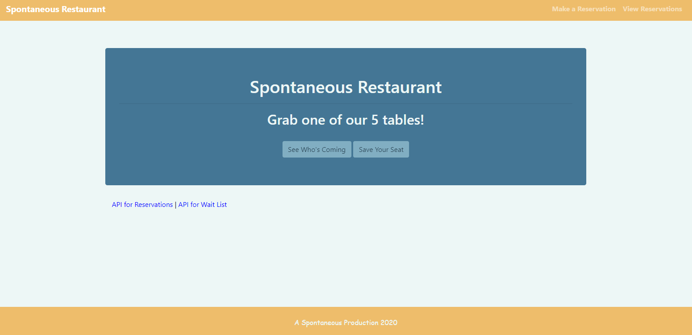

# Spontaneous Restaurant 

## Description

This is a restaurant app that uses Node and Express with jQuery to schedule reservations and maintain a wait list.

## Table of Contents

-

- [Usage](#usage)
- [License](#license)
- [Contributors](#contributors)
- [Tests](#tests)
- [Questions](#questions)

## Usage

The model for this website app could be used by restaurants to keep their reservations and waitlist organized.

## License

MIT License

The MIT License is a permissive license with only very limited restriction on reuse and has good compatibility because it can be re-licensed under other licenses

## Contributors

This project was created by Cyrus Jose, Melinda Winter, Kate An, Kevin Cabe, and Joshuah Montero.

## Questions

You can find the contributors on GitHub:

- [Cyrus Jose](https://github.com/cyrusjose)
- [Melinda Winter](https://github.com/melindawinter)
- [Kate An](https://github.com/katean004)
- [Joshuah Montero](https://github.com/Joshemon)
- [Kevin Cabe](https://github.com/softwaresCabe)
